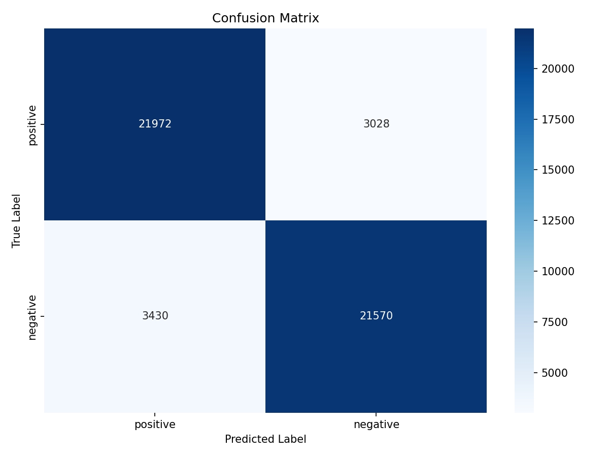

# Sentiment Analysis Project

A simple sentiment analysis project that predicts whether text reviews are positive or negative. Uses IMDB movie reviews to train a classifier that can tell if a review is positive or negative.

## What it does

Takes a bunch of text reviews and figures out if they're positive or negative. The pipeline is pretty straightforward:

1. **Preprocessing** - Cleans up the text (lowercase, removes HTML tags, punctuation, stopwords)
2. **Feature extraction** - Converts text to numbers using TF-IDF
3. **Training** - Trains a Logistic Regression model on the data
4. **Evaluation** - Tests how well it works and shows metrics
5. **Visualization** - Makes word clouds and confusion matrix plots

## Results

Trained on 50,000 IMDB movie reviews with an 80/20 train/test split:

**Performance Metrics:**
- **Overall Accuracy**: 87.1%
- **F1 Score**: 0.872   
- **Precision**: 87% (both classes)
- **Recall**: 87% (both classes)

The model performs well at distinguishing positive from negative reviews. Both classes have balanced precision and recall, which means it's not biased toward one class. The train accuracy (87.2%) and test accuracy (86.5%) are close, so there's no major overfitting.

**Confusion Matrix:**



The confusion matrix shows the model correctly predicts most reviews. The diagonal values (true positives and true negatives) are much higher than the off-diagonal ones (false positives and false negatives), which is what we want.

## Tech Stack

- Python 3.x
- pandas - for loading CSV data
- scikit-learn - for the ML model and TF-IDF
- nltk - for text preprocessing
- matplotlib & seaborn - for plots
- wordcloud - for the word cloud images

## Setup

Install the packages:

```bash
pip install -r requirements.txt
```

NLTK will download the required data automatically when you run the scripts for the first time.

## How to Run

Run these scripts in order from the `scripts/` folder:

1. **Preprocess the data**:
   ```bash
   cd scripts
   python preprocess.py
   ```
   This processes all the reviews and saves cleaned text to `data/processed_reviews.csv`. Takes a few minutes with 50k reviews.

2. **Train the model**:
   ```bash
   python train_model.py
   ```
   Trains the classifier and saves it to `outputs/sentiment_model.pkl`. Also saves the vectorizer to `outputs/vectorizer.pkl`.

3. **Evaluate and visualize**:
   ```bash
   python evaluate_model.py
   ```
   Shows accuracy, F1 score, and classification report. Creates visualizations in the `outputs/` folder.

## Output Files

After running everything, you'll get:

- `outputs/sentiment_model.pkl` - the trained model
- `outputs/vectorizer.pkl` - the TF-IDF vectorizer (needed to process new text)
- `outputs/confusion_matrix.png` - heatmap showing prediction accuracy
- `outputs/wordcloud_positive.png` - most frequent words in positive reviews
- `outputs/wordcloud_negative.png` - most frequent words in negative reviews

## Project Files

Main files:
- `data/reviews.csv` - the original dataset (50k IMDB reviews)
- `data/processed_reviews.csv` - cleaned text (generated by preprocess.py)
- `scripts/preprocess.py` - text cleaning and preprocessing
- `scripts/train_model.py` - model training
- `scripts/evaluate_model.py` - evaluation and visualization
- `outputs/` - all the generated models and plots go here

## Notes

- Uses TF-IDF with max 1000 features and includes both single words and bigrams
- The model is saved with pickle so you can load it later to predict on new reviews
- You could try different models (Random Forest, SVM) or tweak the preprocessing if you want to experiment

